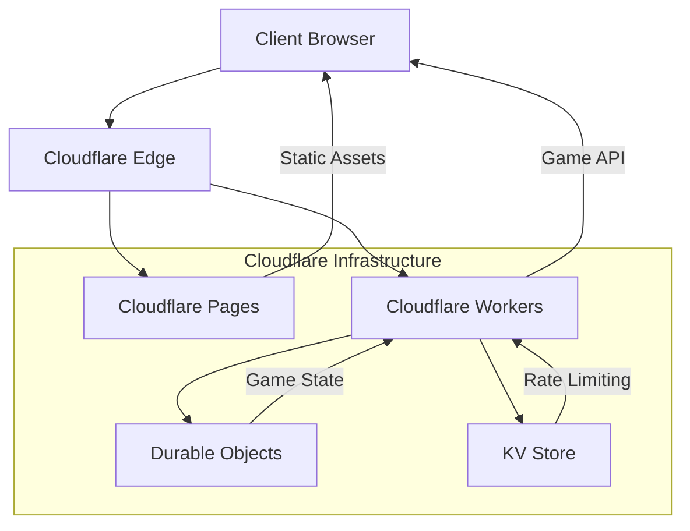
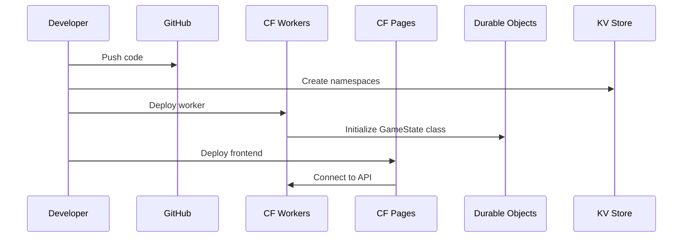
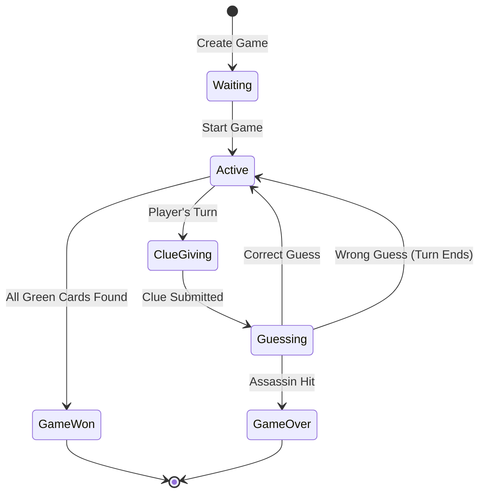
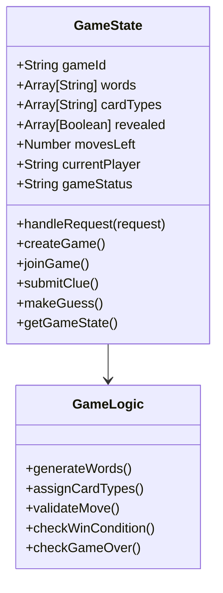
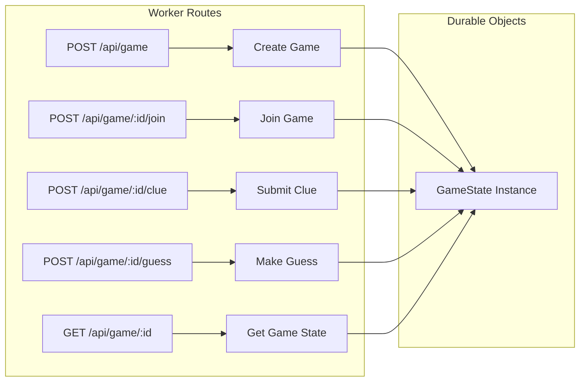

# Codenames: Duet

A web-based implementation of the cooperative word game Codenames: Duet, built with Cloudflare technologies.

## 🎮 Live Demo

- **Game**: https://b89c6dd8.codenames-duet.pages.dev
- **Worker API**: https://codenames-duet-worker.oluwasanya-awe.workers.dev

## ✨ Features

- **Cooperative gameplay**: Two players work together to find all green cards
- **Real-time updates**: Built with Cloudflare Workers and Durable Objects
- **Minimal dependencies**: Uses vanilla JavaScript and CSS
- **Mobile-friendly**: Responsive design that works on all devices
- **Persistent game state**: Games survive browser refreshes and network interruptions
- **Rate limiting**: Built-in protection against spam and abuse
- **Scalable architecture**: Leverages Cloudflare's global edge network

## 🎯 How to Play

1. **Objective**: Find all 15 green cards before running out of moves (9 total)
2. **Turns**: Players alternate giving clues and making guesses
3. **Clues**: Give a one-word clue and a number indicating how many cards relate to it
4. **Guessing**: Click on cards to reveal them
5. **Card Types**:
   - **Green**: Good! You need to find all 15
   - **Neutral**: Safe but ends your turn
   - **Assassin**: Game over! Avoid these 3 cards

## 🏗️ Architecture Overview

This application demonstrates a modern serverless architecture using Cloudflare's ecosystem:



### Component Breakdown

- **Cloudflare Pages**: Serves static frontend assets (HTML, CSS, JS)
- **Cloudflare Workers**: Handles game logic and API endpoints
- **Durable Objects**: Provides persistent, consistent game state storage
- **KV Store**: Manages rate limiting and caching

## 🚀 Deployment Flow



## 🎲 Game Flow Architecture



## 🔧 Technical Implementation

### Durable Objects State Management



### API Endpoints



## 🛠️ Development

### Prerequisites

- Node.js (v18 or later)
- Cloudflare account
- Wrangler CLI

### Setup

1. **Install dependencies:**
```bash
npm install
```

2. **Configure Wrangler (first time only):**
```bash
npx wrangler login
```

3. **Create KV namespaces:**
```bash
npx wrangler kv:namespace create "RATE_LIMIT"
npx wrangler kv:namespace create "RATE_LIMIT" --preview
```

4. **Update wrangler.toml with the generated namespace IDs**

### Local Development

1. **Start the worker in development mode:**
```bash
npm run worker:dev
```

2. **In another terminal, start the Pages development server:**
```bash
npm run dev
```

3. **Open your browser to `http://localhost:8788`**

### Deployment

1. **Deploy the worker:**
```bash
npm run worker:deploy
```

2. **Deploy the frontend:**
```bash
npm run deploy
```

## 📁 File Structure

```
codenames-duet/
├── public/                 # Frontend assets
│   ├── index.html         # Main game interface
│   ├── styles.css         # Game styling
│   └── app.js            # Client-side game logic
├── worker/                # Cloudflare Worker
│   ├── index.js          # Worker entry point & API routes
│   └── game-logic.js     # Game rules and logic
├── package.json          # Dependencies and scripts
├── wrangler.toml         # Worker configuration
├── wrangler-pages.toml   # Pages configuration
├── _headers              # Cloudflare Pages headers
└── README.md            # This file
```

## 🎮 Game Rules

Codenames: Duet is a cooperative variant where:

- **Grid**: 25 cards arranged in a 5x5 grid
- **Target Cards**: 15 green cards (your targets)
- **Assassin Cards**: 3 cards that end the game if revealed
- **Neutral Cards**: 7 cards that are safe but end your turn
- **Moves**: 9 total moves to find all green cards
- **Failure**: Hitting an assassin ends the game immediately
- **Victory**: Find all 15 green cards within 9 moves

## 🔐 Security Features

- **Rate Limiting**: KV-based rate limiting prevents spam
- **Input Validation**: All user inputs are validated server-side
- **Sanitization**: User-generated content is properly sanitized
- **CORS**: Proper CORS headers for secure cross-origin requests

## 🌐 Cloudflare Technologies Used

- **Workers**: Serverless compute for game logic
- **Durable Objects**: Consistent, persistent game state
- **KV Store**: Fast, eventually consistent key-value storage
- **Pages**: Static site hosting with edge optimization
- **Edge Network**: Global distribution for low latency

## 🚀 Performance Optimizations

- **Edge Computing**: Game logic runs at Cloudflare's edge
- **Persistent State**: Durable Objects eliminate cold starts
- **Caching**: Strategic caching of game assets
- **Minimal Bundle**: Vanilla JS keeps payload small
- **Compression**: Gzip compression for all assets

## 🐛 Troubleshooting

### Common Issues

1. **KV Namespace Error**: Ensure KV namespaces are created and IDs match in wrangler.toml
2. **Durable Objects Error**: Use `new_sqlite_classes` for free plan
3. **CORS Issues**: Check _headers file configuration
4. **Rate Limiting**: Wait a moment between requests if hitting limits

### Monitoring

- Check Cloudflare Dashboard for Worker metrics
- Monitor Durable Objects usage and performance
- Review KV Store access patterns

## 📊 Metrics and Analytics

The application includes built-in metrics for:
- Game creation and completion rates
- Player engagement metrics
- API response times
- Error rates and debugging

## 🤝 Contributing

1. Fork the repository
2. Create a feature branch
3. Make your changes
4. Test thoroughly
5. Submit a pull request

## 📜 License

This project is licensed under the MIT License - see the LICENSE file for details.

## 🙏 Acknowledgments

- Original Codenames game by Vlaada Chvátil
- Codenames: Duet variant by Scot Eaton and Vlaada Chvátil
- Cloudflare for providing the serverless infrastructure